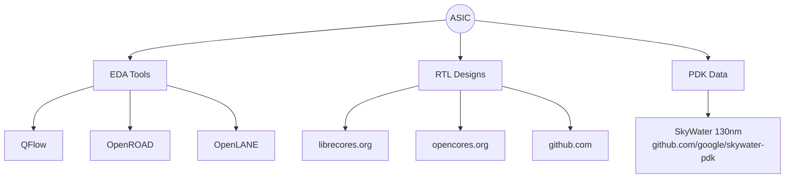

# Physical-design-Workshop

Firstly, let us understand the entire RTL to GDS flow

# SoC Physical Design with OpenLANE — Beginner's Notes

---

## 1. The Core Equation

Everything in digital ASIC design boils down to this:

| Ingredient | What it is |
|---|---|
| **RTL IP's** | Your Verilog/HDL design or reused IP blocks |
| **EDA Tools** | Software that turns RTL into physical layout |
| **PDK Data** | The "interface" between the fab and the designer |

Historically all three were **closed-source**. The open-source movement (Google + SkyWater, OpenROAD, OpenLANE) opened up all three for the first time — enabling a fully open RTL-to-GDSII flow.

---

## 2. What is a PDK? (Process Design Kit)

A PDK is a collection of files that model a fabrication process for EDA tools. It's what lets you design a chip *without* needing to be the fab.

| Contains | Purpose |
|---|---|
| Process Design Rules | DRC, LVS, PEX |
| Device Models | Transistor-level electrical behavior |
| Digital Standard Cell Libraries | Pre-built logic gates (AND, NAND, XOR, etc.) |
| I/O Libraries | Pad/interface cells |

**Milestone:** June 30, 2020 — Google + SkyWater released **SKY130**, the **first-ever fully open-source production PDK** (Apache 2.0 license, 130nm node). This is the PDK OpenLANE is tuned for. https://github.com/google/skywater-pdk

> 💡 **Is 130nm too old to matter?** No — it's still ~13% of foundry sales by volume, and designs like a single-cycle RV32I have hit 327 MHz post-layout (>1GHz pipelined) on SKY130.

---

## 3. The RTL → GDSII Flow in OpenLane
This is the **backbone of physical design** — memorize this pipeline before anything else.

### Stage-by-stage cheat sheet

| Stage | What happens | Key detail |
|---|---|---|
| **1. Synthesis** | RTL → gate-level netlist using **standard cells** | Each std cell has multiple views: electrical, HDL, SPICE, layout (abstract + detailed) |
| **2. Floor & Power Planning** | Partition the die among blocks, place I/O pads, define macro dimensions/pins/rows, build power grid | Two sub-steps: **Chip floorplanning** (macro-level) + **Power planning** (VDD/VSS rings, straps, pads) |
| **3. Placement** | Place gate-level cells onto floorplan rows, aligned to sites | Done in **2 passes: Global → Detailed** |
| **4. Clock Tree Synthesis (CTS)** | Build a clock distribution network to every flip-flop | Goal: minimum skew (zero is unrealistic), usually an H-tree or X-tree shape |
| **5. Routing** | Wire up the netlist using metal layers | Huge routing grid → **divide & conquer**: Global routing (guides) → Detailed routing (actual wires) |
| **6. Sign-Off** | Final physical + timing verification | **DRC** (Design Rule Check), **LVS** (Layout vs. Schematic), **STA** (Static Timing Analysis) |

---

## 4. The Open-Source EDA Toolchain (what tool does what)

| Task | Tool | Notes |
|---|---|---|
| RTL Synthesis | **Yosys** + **ABC** | HDL → gate-level netlist |
| Place & Route (Floorplan → CTS → Routing) | **OpenROAD** | The "physical implementation" engine |
| Layout viewing / DRC / SPICE extraction | **Magic VLSI** | Also used for antenna-rule checking |
| Layout vs. Schematic (LVS) | **Netgen** (+ Magic) | Extracted SPICE (Magic) vs. Verilog netlist |
| Static Timing Analysis | **OpenSTA** (part of OpenROAD) | Input: `.spef` (from DEF2SPEF RC extraction) |
| Logic Equivalence Check (LEC) | **Yosys** | Confirms function unchanged after netlist-modifying steps (CTS, post-placement opt) |
| Design-for-Test (DFT) | **Fault** | Scan insertion, ATPG, fault coverage/simulation |
| GDSII viewing/streaming | **KLayout** / **Magic** | |
| End-to-end orchestration | **OpenLANE** | Wraps *all* of the above into one flow |

---

## 5. What is OpenLANE?

OpenLANE is the **automated RTL→GDSII flow** (aka automated Place-and-Route / Physical Implementation) that stitches together the open-source tools above.

- Originated from the **striVe** family of "open everything" SoCs (open PDK + open EDA + open RTL), created as a true open-source tapeout experiment.
- **Main goal:** produce a *clean* GDSII with **no human intervention** ("no-human-in-the-loop")
  - Clean = **no LVS violations**, **no DRC violations** (timing violations = work in progress at time of talk)
- Tuned for **SkyWater 130nm** open PDK (also supports XFAB180, GF130G)
- **Containerized** — functional out of the box (native build/run instructions to follow)

### Modes of operation
| Mode | Description |
|---|---|
| **Autonomous** | "Push-button" — full flow runs end-to-end automatically |
| **Interactive** | Run flow commands one-by-one — useful for debugging/tuning |
| **Design Space Exploration (DSE)** | Sweeps flow configurations to find the best settings for a given design (has example configs across 43+ designs, and growing) |

**Regression Testing / CI:** OpenLANE is run against ~70 known designs and compared against best-known results to catch regressions — good practice to borrow for your own flow validation.

---

## 6. Two Concepts Every Beginner Trips On

### A. Antenna Rule Violations
During fabrication, long metal wire segments can act like unintended **antennas**: reactive ion etching accumulates charge on the wire, which can damage the connected transistor gate.

**Two fixes:**
1. **Bridging** — route through a higher metal layer as an intermediary (requires router awareness — not always available)
2. **Antenna diodes** — insert a diode cell to leak away the charge (provided by the standard cell library)

**OpenLANE's preventive approach:**
1. Insert a *fake* antenna diode next to every cell input after placement
2. Run the antenna checker (Magic) on the routed layout
3. If a violation is reported on a cell input pin → swap the fake diode for a real one

### B. Logic Equivalence Check (LEC)
Any time the netlist is modified post-synthesis (CTS insertion, post-placement optimization), you **must** re-verify functional equivalence — this is what **Yosys-based LEC** does, comparing pre/post-modification netlists formally (not just simulation).

---

## 7. Quick-Start Mental Model (TL;DR for a new physical design engineer)

1. Get comfortable with the **RTL → GDSII** pipeline order: `Synth → Floorplan/Power Plan → Place → CTS → Route → Sign-off`
2. Know **which tool owns which stage** (table in section 4) — when something breaks, you'll know where to look
3. Understand the **PDK** is your contract with the fab — SKY130 is the standard free playground
4. Learn to read **DRC / LVS / STA** reports — these are your sign-off gates
5. Try OpenLANE in **interactive mode** first (not autonomous) so you can inspect each stage's output before trusting the push-button flow
6. Watch out for **antenna violations** and always re-run **LEC** after any netlist-altering step

---

## Resources
- OpenLANE: [openlane.io](https://openlane.io)
- SkyWater open PDK: [github.com/google/skywater-pdk](https://github.com/google/skywater-pdk)
- OpenROAD: OpenROAD Project
- Fault (DFT toolchain): bit.ly/3gSyIUU
- CloudV (cloud Verilog IDE/simulator): [cloudv.io](https://cloudv.io)

